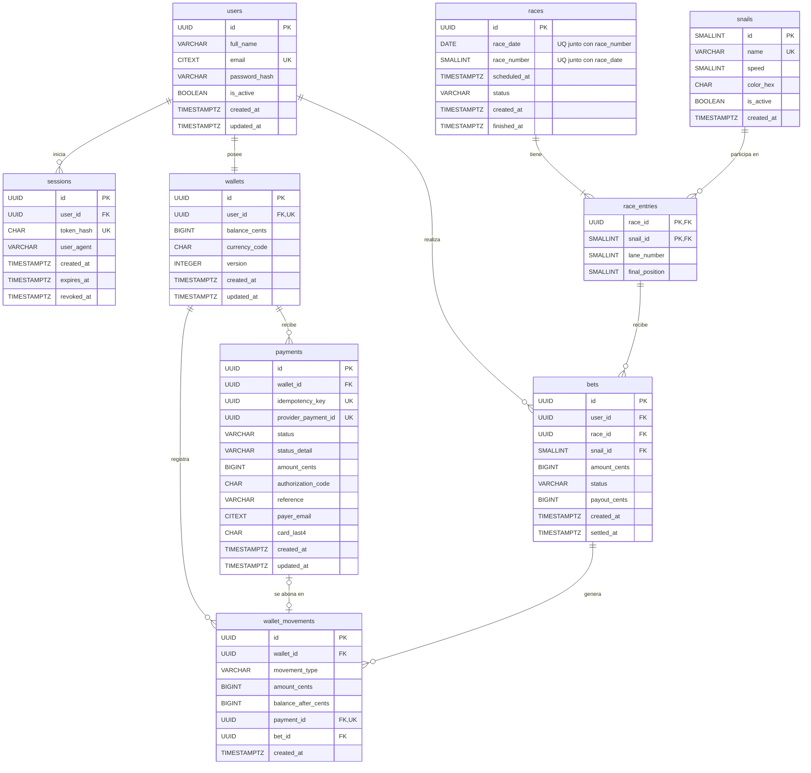

# Propuesta de base de datos

Cómo conectaría Caracolandia con una base de datos, reemplazando `localStorage` como fuente de
verdad. **No está implementada**: es una propuesta de diseño. El DDL completo está en
[`schema.sql`](./schema.sql); se validó su sintaxis con el parser oficial de PostgreSQL
(`pglast`) y que cada llave foránea apunte a una llave primaria o única existente, pero no se
ejecutó contra un servidor.

## 1. Tecnología

| Elemento       | Elección                  | Motivo                                                                      |
| -------------- | ------------------------- | --------------------------------------------------------------------------- |
| Motor          | **PostgreSQL 16+**        | Transacciones ACID (indispensables para dinero), `CHECK`, `UUID`, `CITEXT`. |
| Acceso a datos | Drizzle ORM o Prisma      | Tipado de extremo a extremo con TypeScript y migraciones versionadas.       |
| Migraciones    | Herramienta del ORM       | Cada cambio de esquema queda en el repositorio y es reproducible.           |
| Contraseñas    | Argon2id (en el servidor) | Recomendación actual de OWASP; reemplaza PBKDF2 del navegador.              |

## 2. Estándar de nomenclatura

| Elemento                | Regla                                               | Ejemplo                          |
| ----------------------- | --------------------------------------------------- | -------------------------------- |
| Tablas                  | `snake_case`, **plural**                            | `users`, `race_entries`          |
| Columnas                | `snake_case`, singular                              | `full_name`, `race_number`       |
| Llave primaria          | `id`                                                | `users.id`                       |
| Llave foránea           | `<tabla_en_singular>_id`                            | `user_id`, `wallet_id`           |
| Tabla intermedia (N:M)  | `<tabla_a>_<concepto>`                              | `race_entries` (races ↔ snails)  |
| Restricciones e índices | `pk_`, `fk_`, `uq_`, `ck_`, `ix_` + tabla + columna | `fk_bets_user`, `uq_users_email` |

**Convención de campos por tipo de dato:**

| Tipo de dato              | Tipo PostgreSQL                  | Convención de nombre         | Ejemplo                    |
| ------------------------- | -------------------------------- | ---------------------------- | -------------------------- |
| Identificador             | `UUID` (`SMALLINT` en catálogos) | `id` / `<entidad>_id`        | `id`, `user_id`            |
| Fecha y hora              | `TIMESTAMPTZ` (UTC)              | sufijo `_at`                 | `created_at`, `expires_at` |
| Fecha sin hora            | `DATE`                           | sufijo `_date`               | `race_date`                |
| Dinero                    | `BIGINT` en centavos             | sufijo `_cents`              | `amount_cents`             |
| Booleano                  | `BOOLEAN`                        | prefijo `is_`                | `is_active`                |
| Estado / catálogo cerrado | `VARCHAR` + `CHECK`              | `status` o `<concepto>_type` | `status`, `movement_type`  |
| Código corto              | `CHAR(n)`                        | sufijo `_code`               | `authorization_code`       |
| Texto                     | `VARCHAR(n)` / `CITEXT`          | descriptivo                  | `full_name`, `email`       |
| Contador / número         | `SMALLINT` / `INTEGER`           | descriptivo                  | `race_number`, `version`   |

Toda tabla tiene `created_at`; las que se modifican también tienen `updated_at`.

## 3. Diagrama entidad-relación

## 4. Diccionario de datos

Leyenda: **PK** llave primaria · **FK** llave foránea · **UQ** único · **NN** no nulo.

### `users`: cuentas registradas

| Columna         | Tipo           | Restricciones      | Descripción                                                |
| --------------- | -------------- | ------------------ | ---------------------------------------------------------- |
| `id`            | `UUID`         | **PK**, NN         | Identificador del usuario.                                 |
| `full_name`     | `VARCHAR(80)`  | NN, CHECK ≥ 3 car. | Nombre completo.                                           |
| `email`         | `CITEXT`       | NN, **UQ**         | Correo; `CITEXT` hace la unicidad insensible a mayúsculas. |
| `password_hash` | `VARCHAR(255)` | NN                 | Hash Argon2id (incluye sal y parámetros).                  |
| `is_active`     | `BOOLEAN`      | NN, default `TRUE` | Permite desactivar sin borrar.                             |
| `created_at`    | `TIMESTAMPTZ`  | NN                 | Alta.                                                      |
| `updated_at`    | `TIMESTAMPTZ`  | NN                 | Última modificación.                                       |

### `sessions`: sesiones activas y cerradas

| Columna      | Tipo           | Restricciones                  | Descripción                                                            |
| ------------ | -------------- | ------------------------------ | ---------------------------------------------------------------------- |
| `id`         | `UUID`         | **PK**                         | Identificador de la sesión.                                            |
| `user_id`    | `UUID`         | **FK → users.id**, NN, CASCADE | Dueño de la sesión.                                                    |
| `token_hash` | `CHAR(64)`     | NN, **UQ**                     | SHA-256 del token; el token en claro solo va en una cookie `HttpOnly`. |
| `user_agent` | `VARCHAR(255)` |                                | Navegador o dispositivo.                                               |
| `created_at` | `TIMESTAMPTZ`  | NN                             | Inicio.                                                                |
| `expires_at` | `TIMESTAMPTZ`  | NN, CHECK > `created_at`       | Expiración (8 h, igual que hoy).                                       |
| `revoked_at` | `TIMESTAMPTZ`  |                                | Se llena al cerrar sesión.                                             |

### `wallets`: saldo del usuario (1:1)

| Columna                     | Tipo          | Restricciones                 | Descripción                                           |
| --------------------------- | ------------- | ----------------------------- | ----------------------------------------------------- |
| `id`                        | `UUID`        | **PK**                        | Identificador del monedero.                           |
| `user_id`                   | `UUID`        | **FK → users.id**, NN, **UQ** | El `UNIQUE` convierte la relación en 1:1.             |
| `balance_cents`             | `BIGINT`      | NN, default 0, CHECK ≥ 0      | Saldo vigente; es un caché de la suma de movimientos. |
| `currency_code`             | `CHAR(3)`     | NN, default `MXN`             | Moneda ISO 4217.                                      |
| `version`                   | `INTEGER`     | NN                            | Bloqueo optimista ante actualizaciones concurrentes.  |
| `created_at` / `updated_at` | `TIMESTAMPTZ` | NN                            | Auditoría.                                            |

### `payments`: intentos de recarga con SnailPay

| Columna                     | Tipo          | Restricciones                               | Descripción                                                                     |
| --------------------------- | ------------- | ------------------------------------------- | ------------------------------------------------------------------------------- |
| `id`                        | `UUID`        | **PK**                                      | Identificador interno del pago.                                                 |
| `wallet_id`                 | `UUID`        | **FK → wallets.id**, NN                     | Monedero a recargar.                                                            |
| `idempotency_key`           | `UUID`        | NN, **UQ**                                  | Lo genera el cliente; un reintento nunca cobra dos veces.                       |
| `provider_payment_id`       | `UUID`        | **UQ**                                      | `id` de SnailPay; `NULL` si hubo timeout.                                       |
| `status`                    | `VARCHAR(20)` | NN, CHECK `pending/approved/rejected/error` | Estado general.                                                                 |
| `status_detail`             | `VARCHAR(60)` | NN                                          | Detalle devuelto por SnailPay.                                                  |
| `amount_cents`              | `BIGINT`      | NN, CHECK 1 – 1,000,000                     | Monto solicitado (máx. $10,000).                                                |
| `authorization_code`        | `CHAR(6)`     | CHECK: solo y siempre si `approved`         | Código de autorización.                                                         |
| `reference`                 | `VARCHAR(30)` |                                             | Referencia de la operación.                                                     |
| `payer_email`               | `CITEXT`      | NN                                          | Correo del pagador al momento del pago.                                         |
| `card_last4`                | `CHAR(4)`     | NN, CHECK 4 dígitos                         | Últimos 4 dígitos. **No se guardan ni el número completo ni el CVV (PCI DSS).** |
| `created_at` / `updated_at` | `TIMESTAMPTZ` | NN                                          | Auditoría.                                                                      |

### `wallet_movements`: libro mayor de saldo

| Columna               | Tipo          | Restricciones                                      | Descripción                                                              |
| --------------------- | ------------- | -------------------------------------------------- | ------------------------------------------------------------------------ |
| `id`                  | `UUID`        | **PK**                                             | Identificador del movimiento.                                            |
| `wallet_id`           | `UUID`        | **FK → wallets.id**, NN                            | Monedero afectado.                                                       |
| `movement_type`       | `VARCHAR(20)` | NN, CHECK `top_up/bet_stake/bet_payout/bet_refund` | Tipo de movimiento.                                                      |
| `amount_cents`        | `BIGINT`      | NN, CHECK ≠ 0                                      | Positivo = abono, negativo = cargo.                                      |
| `balance_after_cents` | `BIGINT`      | NN, CHECK ≥ 0                                      | Saldo resultante (auditoría).                                            |
| `payment_id`          | `UUID`        | **FK → payments.id**, **UQ**                       | Origen si es recarga; el `UNIQUE` impide abonar dos veces el mismo pago. |
| `bet_id`              | `UUID`        | **FK → bets.id**                                   | Origen si es apuesta, premio o reembolso.                                |
| `created_at`          | `TIMESTAMPTZ` | NN                                                 | Fecha del movimiento.                                                    |

Un `CHECK` garantiza que cada movimiento tenga **exactamente un origen** (pago o apuesta) congruente
con su tipo, y `UNIQUE (bet_id, movement_type)` evita cobrar o pagar dos veces la misma apuesta.

### `snails`: catálogo de caracoles

| Columna      | Tipo          | Restricciones       | Descripción                                |
| ------------ | ------------- | ------------------- | ------------------------------------------ |
| `id`         | `SMALLINT`    | **PK**, identity    | Catálogo pequeño: basta un entero.         |
| `name`       | `VARCHAR(40)` | NN, **UQ**          | Nombre del caracol.                        |
| `speed`      | `SMALLINT`    | NN, CHECK 1–10      | Velocidad (probabilidad de ganar).         |
| `color_hex`  | `CHAR(7)`     | NN, CHECK `#RRGGBB` | Color en las gráficas.                     |
| `is_active`  | `BOOLEAN`     | NN                  | Retira un caracol sin borrar su historial. |
| `created_at` | `TIMESTAMPTZ` | NN                  | Alta.                                      |

### `races`: carreras del día

| Columna                      | Tipo          | Restricciones                            | Descripción                  |
| ---------------------------- | ------------- | ---------------------------------------- | ---------------------------- |
| `id`                         | `UUID`        | **PK**                                   | Identificador de la carrera. |
| `race_date`                  | `DATE`        | NN, **UQ** con `race_number`             | Día de la carrera.           |
| `race_number`                | `SMALLINT`    | NN, CHECK 1–6                            | Número de carrera en el día. |
| `scheduled_at`               | `TIMESTAMPTZ` | NN                                       | Hora programada.             |
| `status`                     | `VARCHAR(20)` | NN, CHECK `scheduled/finished/cancelled` | Estado.                      |
| `created_at` / `finished_at` | `TIMESTAMPTZ` | `created_at` NN                          | Alta y término.              |

### `race_entries`: participantes de cada carrera (N:M races ↔ snails)

| Columna          | Tipo       | Restricciones                                | Descripción                                                          |
| ---------------- | ---------- | -------------------------------------------- | -------------------------------------------------------------------- |
| `race_id`        | `UUID`     | **PK compuesta**, **FK → races.id**, CASCADE | Carrera.                                                             |
| `snail_id`       | `SMALLINT` | **PK compuesta**, **FK → snails.id**         | Caracol.                                                             |
| `lane_number`    | `SMALLINT` | NN, CHECK 1–6, **UQ** por carrera            | Carril.                                                              |
| `final_position` | `SMALLINT` | CHECK 1–6, **UQ** por carrera                | Posición final; el `UNIQUE` asegura **un solo ganador** por carrera. |

### `bets`: apuestas

| Columna                     | Tipo               | Restricciones                         | Descripción                                                  |
| --------------------------- | ------------------ | ------------------------------------- | ------------------------------------------------------------ |
| `id`                        | `UUID`             | **PK**                                | Identificador de la apuesta.                                 |
| `user_id`                   | `UUID`             | **FK → users.id**, NN                 | Quién apuesta.                                               |
| `race_id`, `snail_id`       | `UUID`, `SMALLINT` | NN, **FK compuesta → race_entries**   | Solo se puede apostar a un caracol que corre en esa carrera. |
| `amount_cents`              | `BIGINT`           | NN, CHECK > 0                         | Monto apostado.                                              |
| `status`                    | `VARCHAR(20)`      | NN, CHECK `pending/won/lost/refunded` | Resultado.                                                   |
| `payout_cents`              | `BIGINT`           | NN, default 0, CHECK ≥ 0              | Premio pagado.                                               |
| `created_at` / `settled_at` | `TIMESTAMPTZ`      | `created_at` NN                       | Alta y liquidación.                                          |

## 5. Relaciones

| Relación                        | Cardinalidad | Implementación                                                                        |
| ------------------------------- | ------------ | ------------------------------------------------------------------------------------- |
| `users` → `sessions`            | 1 : N        | `sessions.user_id` FK (`ON DELETE CASCADE`)                                           |
| `users` → `wallets`             | 1 : 1        | `wallets.user_id` FK + `UNIQUE`                                                       |
| `users` → `bets`                | 1 : N        | `bets.user_id` FK                                                                     |
| `wallets` → `payments`          | 1 : N        | `payments.wallet_id` FK                                                               |
| `wallets` → `wallet_movements`  | 1 : N        | `wallet_movements.wallet_id` FK                                                       |
| `payments` → `wallet_movements` | 1 : 0..1     | `wallet_movements.payment_id` FK + `UNIQUE` (solo pagos aprobados generan movimiento) |
| `races` ↔ `snails`              | N : M        | Tabla intermedia `race_entries` con PK compuesta                                      |
| `race_entries` → `bets`         | 1 : N        | `bets (race_id, snail_id)` FK compuesta                                               |
| `bets` → `wallet_movements`     | 1 : 0..3     | `wallet_movements.bet_id` FK + `UNIQUE (bet_id, movement_type)`                       |

Política de borrado: `RESTRICT` en todo lo financiero (nunca se pierde historial de dinero) y
`CASCADE` solo en datos derivados (sesiones y participantes de una carrera).

## 6. Flujo de una recarga con base de datos

1. El frontend envía la recarga al **backend propio** con una `Idempotency-Key`; ya no llama a
   SnailPay directamente.
2. El backend inserta un registro en `payments` con `status = 'pending'`. Si la llave ya existía,
   devuelve el resultado anterior y no vuelve a cobrar.
3. El backend llama a SnailPay de servidor a servidor, con timeout.
4. En **una sola transacción**:
   - actualiza `payments` con la respuesta;
   - si fue aprobada, bloquea el monedero (`SELECT … FOR UPDATE`), inserta un `wallet_movements`
     de tipo `top_up` y actualiza `wallets.balance_cents`.
   - Si algo falla, se revierte todo.
5. Ante un timeout, el pago queda `pending` y un proceso de conciliación consulta después a
   SnailPay. Nunca se acredita a ciegas.

## 7. Cambios necesarios

**Backend**

- Nuevos módulos con la misma arquitectura `routes → controller → service`, más una capa
  `repository` que encapsula el ORM: `auth`, `users`, `wallet`, `payments`, `races` y `bets`.
- Endpoints nuevos:
  - `POST /api/auth/register`, `POST /api/auth/login`, `POST /api/auth/logout`, `GET /api/auth/me`
  - `GET /api/wallet` y `GET /api/wallet/movements`
  - `POST /api/payments` (orquesta SnailPay)
  - `GET /api/dashboard` (datos de las gráficas vía SQL agregando `races`, `race_entries` y `bets`)
- Hash de contraseñas con Argon2id y sesión en cookie `HttpOnly`, `Secure`, `SameSite=Lax`.
  Middleware de autenticación para las rutas protegidas.
- La simulación diaria de carreras pasa a un proceso programado que llena `races` y `race_entries`.
- Configuración `DATABASE_URL`, migraciones en el repositorio y pruebas de integración contra una
  base de datos de prueba.

**Frontend**

- Los servicios de autenticación, monedero y carreras dejan de usar `localStorage` y pasan a
  llamar a la API. Gracias a la separación por capas, **los componentes y las páginas no cambian**.
- `AuthProvider` obtiene el usuario con `GET /api/auth/me` al iniciar, en lugar de leer la sesión local.
- `localStorage` queda solo para preferencias de interfaz. Nunca guarda datos de tarjeta.
- Estados de carga y error para las nuevas peticiones, reutilizando el manejo de errores existente.
